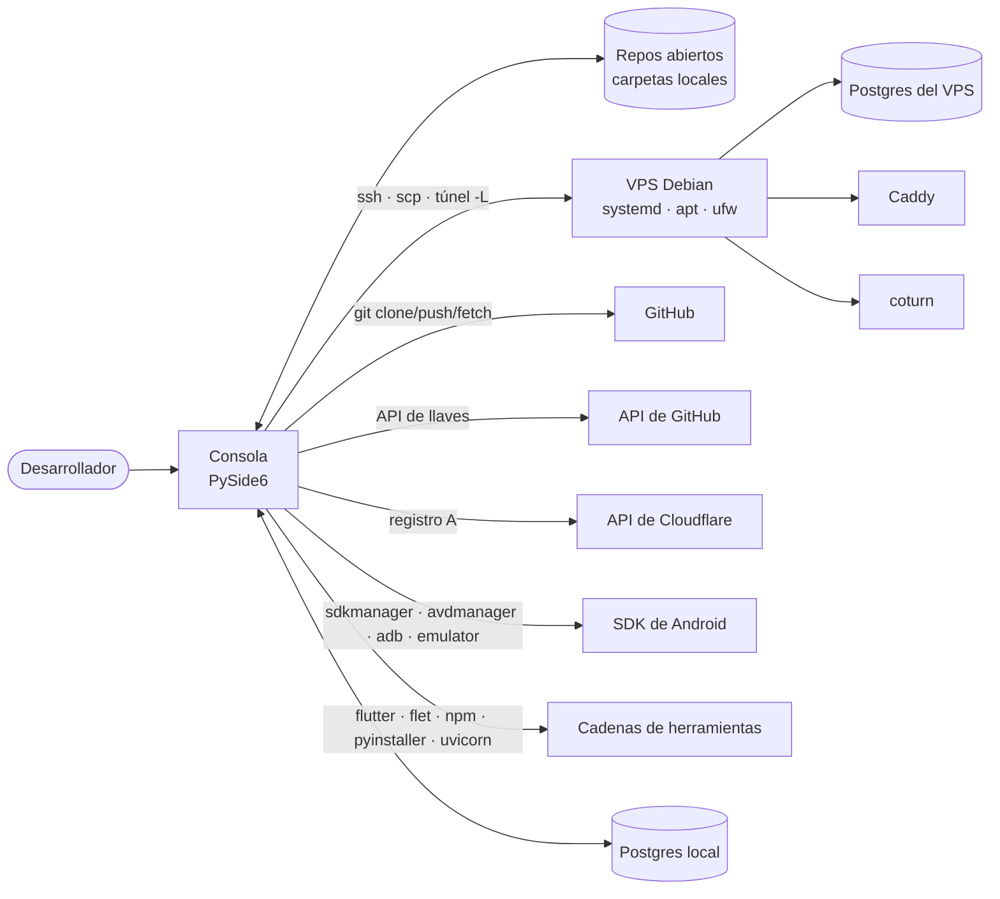

# 01 · Contexto y alcance

## 1. Qué es

Aplicación de escritorio (PySide6) que ejecuta las operaciones de desarrollo y de despliegue de **los repositorios que se le abren como pestañas**: levantar los servidores de desarrollo, compilar y publicar artefactos, aprovisionar y actualizar un VPS, administrar la base de datos y el SDK de Android.

Reemplaza a una carpeta `scripts/` que cada repositorio arrastraba copiada. La lógica vive una sola vez, en la app, y se aplica a cualquier repo abierto.

| Principio | Cómo se ve en el código |
|---|---|
| Un botón ejecuta una función Python, no un script | Nada invoca `python scripts/x/y.py`; el único `subprocess` es a binarios externos reales (`git`, `ssh`, `flutter`, `npm`, `adb`, `psql`, `pyinstaller`) |
| La capacidad se declara y se implementa por separado | `core/catalog.py` declara la forma; `core/tasks/` le da cuerpo con `Registry.bind` ([ADR-0002](../adr/0002-catalogo-declara-tareas-implementan.md)) |
| Lo que varía es un eje del panel, no otro botón | `systemd_action` tiene nueve acciones y un eje; no hay nueve botones ([ADR-0004](../adr/0004-un-boton-por-capacidad.md)) |
| La forma del repo decide qué se ofrece | Las apps, las SPA y el servidor salen de mirar las carpetas (`core/targets.py`); un repo sin migraciones no tiene el botón «Migrar» |
| Nada del núcleo conoce Qt | `core/` no importa PySide6: informa por el `TaskContext` que recibe ([ADR-0005](../adr/0005-todo-pasa-por-taskcontext.md)) |
| Lo destructivo se frena por repo | El seguro mira qué rompe la corrida con esos parámetros, no si el botón «es peligroso» ([ADR-0018](../adr/0018-seguro-por-repo-y-objetivo.md)) |

## 2. Qué no es

- **No es un servidor ni un agente.** No corre nada propio en el VPS: lo que deja allá es configuración en `/etc`, el código del repo clonado de GitHub y artefactos compilados.
- **No es multiusuario ni remoto.** Corre en la máquina de una persona, con sus llaves SSH (`~/.ssh`) y sus SDK.
- **No edita el código de los repos que administra.** Los únicos archivos que escribe dentro de un repo son suyos: `.consola/`, `base.generated.js` de una SPA, `releases/<app>/<plataforma>.json` y el manifiesto de versión al subirlo ([ADR-0021](../adr/0021-configuracion-en-etc-no-en-el-repo.md)).

## 3. Restricciones

| Restricción | Detalle |
|---|---|
| Lenguaje y GUI | Python, PySide6 ≥ 6.7 (`requirements.txt`) |
| Base de datos | `psycopg[binary]` ≥ 3.2, solo para el explorador y sus consultas de introspección |
| Sistemas | Windows y Linux. Hay ramas explícitas por sistema en `core/process.py`, `core/ssh.py`, `core/userenv.py`, `core/files.py` y `core/sysinfo.py` |
| VPS soportado | Debian/Ubuntu con systemd, apt, ufw y Postgres (`core/vps.py`) |
| Sin dependencias de terceros más allá de esas dos | La RAM se lee sin `psutil`, el HTTP se hace con la biblioteca estándar (`core/github.py`, `core/tasks/utils.py`) |
| Sin pruebas automatizadas | No hay ningún `test_*.py` en el repositorio ([30](30_riesgos_y_pendientes.md)) |
| Sin telemetría ni red propia | Solo sale a internet para la API de GitHub, la de Cloudflare y las descargas de los SDK |

## 4. Contexto (C4 nivel 1)

## 5. Alcance del catálogo

62 capacidades registradas: 59 con botón y 3 ocultas (`stop_emulator`, `bump_version`, `upload_to_vps`), que existen como paso de otras o como acción de la interfaz. 40 atómicas y 22 compuestas. Todas tienen cuerpo salvo `dev_env`, que por diseño no lo tiene: su cuerpo es el despachador de la interfaz ([ADR-0011](../adr/0011-compuesta-concurrente-sin-cuerpo.md)).

| Grupo | Botones | Qué resuelve |
|---|---|---|
| Ejecutar | 5 | Levantar lo que corre en desarrollo: backend, SPA, app móvil, app de escritorio, y todo junto |
| Compilar | 6 | Compilar y publicar: Flutter/Flet, Vite, ejecutable, promoción, SPA nueva, limpieza de artefactos |
| Repositorio | 7 | Clonar, los cuatro sobrescritos entre local, origin y VPS, y la sincronización de archivos y claves entre repos |
| Base de datos | 12 | Ciclo de vida del esquema, migraciones, datos, respaldo, túnel y explorador |
| Despliegue | 9 | Publicar el código, el servicio systemd, logs y diagnóstico del VPS |
| VPS | 11 | Aprovisionamiento y desmontaje: paquetes, SSH, GitHub, coturn, Caddy, DNS, bootstrap y revocaciones |
| Emuladores | 4 | Imágenes de sistema, dispositivos virtuales, arranque y limpieza de disco |
| SDKs | 5 | Dejar esta máquina lista para compilar: Android y Flutter |

## 6. Interesados

| Quién | Qué espera |
|---|---|
| El desarrollador que la usa | Que un botón haga lo que dice, sobre el repo que tiene abierto, y que lo destructivo no se dispare en el repo equivocado |
| Los repos administrados | Que Consola no les escriba código: solo su carpeta `.consola/` y lo que declaran como generado |
| El VPS | Que lo que se le escriba sea idempotente y que un archivo no cambie si no cambió su contenido (`core/vps.py::write_config`) |
