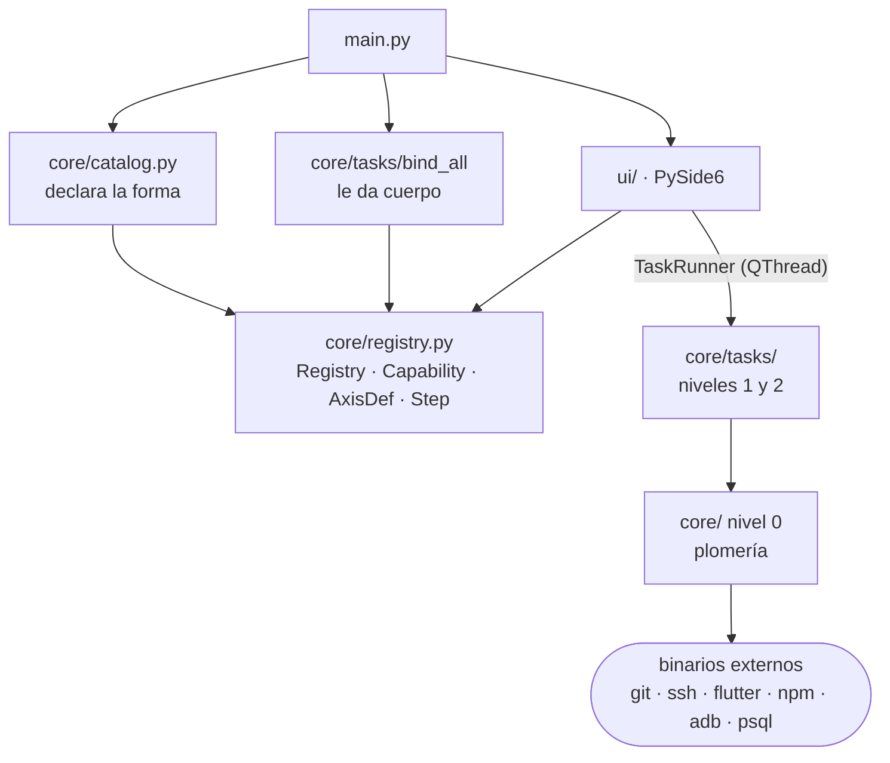

# 02 · Estrategia y bloques

## 1. Tres capas y una regla de dirección

| Nivel | Qué es | ¿Botón? | Dónde vive |
|---|---|---|---|
| **0 — plomería** | Resuelve una clase de problema y no es un paso del dominio: leer un `.env`, armar un `argv` de SSH, elegir un puerto libre | Nunca | `core/*.py` |
| **1 — atómicas** | Una responsabilidad, construida sobre el nivel 0. Casi todas son de tres a diez líneas | Sí, si alguien la pide sola | `core/tasks/*.py` |
| **2 — compuestas** | Encadenan atómicas en un orden fijo. No reimplementan nada: llaman | Sí, además del botón de cada paso | `core/tasks/*.py` |

La dirección es estricta: `ui/` importa de `core/`, `core/tasks/` importa de `core/`, y `core/` no importa ni de `ui/` ni de `core/tasks/`. Las dos excepciones son importaciones diferidas dentro de una función, no de módulo: `core/envfile.py` pide `vps.uses_proxy` para resolver el default de `BACKEND_HOST`, y `core/context.py` pide el registro para traducir el id de un paso a su etiqueta.

## 2. Qué hay en `core/` (nivel 0)

| Módulo | Qué resuelve |
|---|---|
| `errors.py` | `TaskError`, `Cancelled`, `MissingConfig`. Nadie imprime ni sale del proceso |
| `context.py` | `TaskContext`: log, ejecutar, preguntar, publicar un endpoint, cancelar |
| `process.py` | Correr binarios externos: streaming, captura, alimentar stdin, matar el árbol, atar al proceso |
| `envfile.py` | `.consola/config.env`: leer, regenerar, y `Config` con acceso tipado y defaults |
| `settings.py` | El esquema de claves: quién las exige y quién solo las usa |
| `registry.py` | `Registry`, `Capability`, `AxisDef`, `Facet`, `Step`, y el puente a los kwargs |
| `catalog.py` | La declaración de las 61 capacidades y la resolución de ejes contra el repo o contra una fuente consultada |
| `targets.py` | Qué subproyectos y qué características tiene el repo abierto |
| `toolchain.py` | Ubicar `flutter`, `flet`, `npm`, `pyinstaller` y el Python de un venv; las plataformas de build |
| `ssh.py` | `Remote`, ejecución remota, `scp`, túneles, llaves, contraseña sin consola |
| `vps.py` | Rutas del despliegue, paquetes, systemd, journal, tabla de rutas públicas, escritura idempotente |
| `database.py` | Resolver la base local o la remota por túnel, y el canal de superusuario |
| `runner.py` | Dónde corre el código del repo: el venv de acá o el del VPS |
| `db_explorer.py` | Introspección de solo lectura sobre `pg_catalog` |
| `db_models.py` | Los modelos del repo, importados con su propio Python, para comparar contra la base |
| `versioning.py` | Leer y subir la versión de `pubspec.yaml`, `package.json` o `pyproject.toml` |
| `github.py` | Llaves SSH de la cuenta, por título |
| `android.py` | SDK, catálogos de dispositivos e imágenes, AVD, arranque y apagado de emuladores |
| `userenv.py` | Variables y PATH persistentes a nivel usuario, sin administrador |
| `toolstatus.py`, `sysinfo.py` | Qué herramientas hay en la máquina y cuánta RAM queda, para la barra de estado |
| `cache.py` | Caché en disco de los catálogos caros |
| `session.py` | Estado de sesión en memoria: endpoints y valores que una tarea publica para otra |
| `ports.py` | Elegir un puerto libre y esperar a que algo conteste en él |
| `files.py` | Comparar, copiar, borrar, revertir, descomprimir, huella |
| `protection.py` | Qué rompe cada acción destructiva y qué hace la consola con eso |
| `command_docs.py` | El texto largo de cada comando, para la ficha del panel derecho |
| `projects.py` | El `dataclass Project`. La lista la maneja la interfaz |

## 3. Qué hay en `core/tasks/` (niveles 1 y 2)

Un módulo por grupo del catálogo. `bind_all()` recorre los nueve y reemplaza cada stub por su función.

| Módulo | Capacidades |
|---|---|
| `launchers.py` | `backend`, `serve_vite`, `run_mobile`, `run_python`, `ssh_login` |
| `builders.py` | `build_flutter`, `build_vite`, `build_binary`, `create_spa`, `promote_app`, `bump_version`, `upload_to_vps` |
| `emulators.py` | `install_system_image`, `create_avd`, `launch_emulator`, `stop_emulator`, `purge_emulators` |
| `git.py` | `git_force_push`, `git_force_reset`, `clone_repo` |
| `vps_ops.py` | `health_check`, `run_command`, `revoke_ssh`, `revoke_github_ssh`, `clean_vps` |
| `vps_server.py` | `upload_secret_files`, `systemd_action`, `view_logs`, `configure_service`, `publish_code`, `update_remote` |
| `vps_setup.py` | `refresh_known_host`, `setup_ssh_key`, `setup_github_ssh`, `install_software`, `configure_coturn`, `configure_caddy`, `bootstrap_vps` |
| `database.py` | Los doce del grupo Base de datos |
| `utils.py` | Limpieza, Cloudflare, sincronización y los cinco de SDK |
| `payloads.py` | La excepción deliberada: programas Python que viajan por `-c` al intérprete del proyecto |

Dos funciones de `vps_server.py` sirven al grupo Repositorio: con el eje `side` en `vps`, `force_reset` llama a `sync_repository` y `force_push` a `force_push_from_vps`. Están en `vps_server.py` porque son la otra mitad del despliegue, no una operación de git suelta; `git.py` las importa en vez de duplicar el SSH.

## 4. Qué hay en `ui/`

| Bloque | Archivos | Qué hace |
|---|---|---|
| Ventana | `main_window.py`, `title_bar.py`, `project_tabs.py` | Ventana sin marco, repos como pestañas de nivel 1, acento por repo |
| Catálogo a la vista | `menu_bar.py`, `action_search.py`, `widgets/action_row.py`, `favorites.py` | El catálogo entero en una barra de menú y un buscador con ▶ |
| Espacio de trabajo | `tab_panel.py`, `tab_view.py`, `console_view.py`, `browser_view.py` | Pestañas de ejecución de un repo, consola, segunda vista |
| Panel derecho | `params_panel.py`, `env_panel.py`, `security_panel.py`, `command_info_panel.py`, `widgets/accordion.py` | Parámetros, configuración, seguros y ficha, en un acordeón |
| Ejecución | `task_runner.py`, `guard_dialog.py` | Corre la capacidad en un hilo y puentea sus canales; los dos avisos del seguro |
| Explorador | `db_explorer_view.py`, `db_worker.py` | Árbol, datos y estructura, sobre su propio hilo |
| Persistencia | `params_store.py`, `project_store.py`, `section_visibility.py` | `.consola/params.json` del repo y `QSettings` de la máquina |
| Apoyo | `theme.py`, `readiness.py`, `widgets/*` | Colores y tipografía, qué puede correr ya, controles propios |

## 5. `scripts/`

51 archivos Python (9 carpetas temáticas más `common.py`) que son **la especificación de comportamiento, no código que se ejecute**. Ningún módulo de `core/`, `ui/` o `main.py` los importa ni los invoca: se conservan para poder comparar contra el original lo que cada capacidad reimplementa ([ADR-0001](../adr/0001-reimplementar-no-ejecutar-scripts.md)).

## 6. Arranque

`main.py` hace cinco cosas, en orden: fija el escalado de alta densidad, crea la `QApplication`, llama a `load_catalog()` y a `bind_all()`, aplica el tema y muestra la ventana. El catálogo se arma una sola vez por proceso; lo que depende del repo se resuelve después, cada vez que se dibuja un panel ([10](10_catalogo_de_capacidades.md)).
