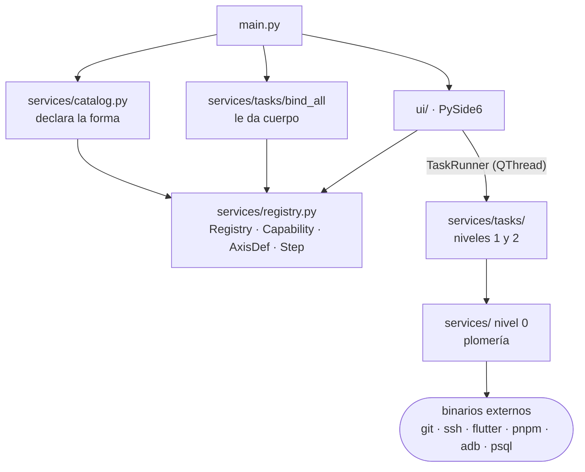

# 02 · Estrategia y bloques

## 1. Tres capas y una regla de dirección

```mermaid
flowchart TD
    MAIN[main.py] --> CAT[services/catalog.py<br/>declara la forma]
    MAIN --> BIND[services/tasks/bind_all<br/>le da cuerpo]
    MAIN --> UI[ui/ · PySide6]
    UI --> REG[services/registry.py<br/>Registry · Capability · AxisDef · Step]
    CAT --> REG
    BIND --> REG
    UI -- "TaskRunner (QThread)" --> T[services/tasks/<br/>niveles 1 y 2]
    T --> N0[services/ nivel 0<br/>plomería]
    N0 --> EXT([binarios externos<br/>git · ssh · flutter · pnpm · adb · psql])
```

| Nivel | Qué es | ¿Botón? | Dónde vive |
|---|---|---|---|
| **0 — plomería** | Resuelve una clase de problema y no es un paso del dominio: leer un `.env`, armar un `argv` de SSH, elegir un puerto libre | Nunca | `services/*.py` |
| **1 — atómicas** | Una responsabilidad, construida sobre el nivel 0. Casi todas son de tres a diez líneas | Sí, si alguien la pide sola | `services/tasks/*.py` |
| **2 — compuestas** | Encadenan atómicas en un orden fijo. No reimplementan nada: llaman | Sí, además del botón de cada paso | `services/tasks/*.py` |

`api/` es todo lo que habla HTTP, y no importa nada de Consola fuera de sí mismo. `http.py` lo hace con el único `QNetworkAccessManager`, en el hilo de la interfaz, bloqueando el hilo de la tarea que llama, con reintentos; también descarga los SDK. Cada servicio tiene su módulo, con sus llamadas y los modelos de Pydantic de lo que se lee: `cloudflare.py`, `flutter.py` (el índice de releases), `android_studio.py` (la página de las herramientas de línea de comandos) e `ip.py` (los servicios de la IP pública). Los usa `services/tasks/utils.py`, que convierte sus errores en `TaskError`: una respuesta que no coincide con su modelo detiene la tarea.

La dirección es estricta: la interfaz (`windows/`, `dialogs/`, `widgets/` y `models/`) importa de `services/` y de `api/`, `services/tasks/` importa de `services/` y de `api/`, y `services/` no importa ni de la interfaz ni de `services/tasks/`. La excepción es una importación diferida dentro de una función, no de módulo: `services/context.py` pide el registro para traducir el id de un paso a su etiqueta. `theme.py` nombra `services/palettes.py` solo en sus anotaciones, porque `palettes.py` importa `theme.py`.

## 2. Qué hay en `services/` (nivel 0)

| Módulo | Qué resuelve |
|---|---|
| `errors.py` | `TaskError`, `Cancelled`, `MissingConfig`. Nadie imprime ni sale del proceso |
| `context.py` | `TaskContext`: log, ejecutar, preguntar, publicar un endpoint, cancelar |
| `process.py` | Correr binarios externos: streaming, captura, alimentar stdin, contestar preguntas, matar el árbol, atar al proceso |
| `envfile.py` | `.consola/config.env`: leer, regenerar, y `Config` con acceso tipado y defaults |
| `settings.py` | El esquema de claves: quién las exige y quién solo las usa |
| `fields.py` | Los campos de `Settings` del repo administrado, leídos con `ast` |
| `canone.py` | Lo que se le pasa a los programas de canone: opciones de `packages.py` y la lista que devuelve con `--list`, argumentos de `install.py`, líneas de `credentials.py` |
| `registry.py` | `Registry`, `Capability`, `AxisDef`, `Facet`, `Step`, y el puente a los kwargs |
| `catalog.py` | La declaración de las 54 capacidades y la resolución de ejes contra el repo o contra una fuente consultada |
| `targets.py` | Qué subproyectos y qué características tiene el repo abierto |
| `toolchain.py` | Ubicar `flutter`, `flet`, `pnpm`, `pyinstaller` y el Python de un venv; las plataformas de build |
| `ssh.py` | `Remote`, ejecución remota con o sin stdin, `scp`, túneles, llaves |
| `vps.py` | Rutas del repo desplegado, los servicios systemd y su journal |
| `database.py` | Resolver la base local o la remota por túnel, y el canal de superusuario |
| `runner.py` | Corre el código del repo con el venv de aquí, contra la base local |
| `db_explorer.py` | Introspección de solo lectura sobre `pg_catalog` |
| `db_models.py` | Los modelos del repo, importados con su propio Python, para comparar contra la base |
| `versioning.py` | Leer y subir la versión de `pubspec.yaml`, `package.json` o `pyproject.toml` |
| `android.py` | SDK, catálogos de dispositivos e imágenes, AVD, arranque y apagado de emuladores |
| `shots.py` | Capturas: argumentos de la cámara, nombre y validación de los crudos, revelado (`shots_presets.json`) |
| `icons.py` | Íconos: qué apps toman el suyo del logo y qué capa va a cada archivo que declaran (pubspec, `icon.png` de Flet, `<link>` y manifest de PWA de una SPA) |
| `userenv.py` | Variables y PATH persistentes a nivel usuario, sin administrador |
| `host.py` | Lo que cambia entre Windows y Linux en esta máquina: nombres de ejecutables, venv, procesos, terminal, Postgres local, entorno, RAM, caché |
| `toolstatus.py`, `sysinfo.py` | Qué herramientas hay en la máquina y cuánta RAM queda, para la barra de estado |
| `cache.py` | Caché en disco de los catálogos caros |
| `session.py` | Estado de sesión en memoria: endpoints y valores que una tarea publica para otra |
| `ports.py` | Elegir un puerto libre y esperar a que algo conteste en él |
| `files.py` | Comparar, copiar, borrar, revertir, descomprimir, huella |
| `protection.py` | Qué rompe cada acción destructiva y qué hace la consola con eso |
| `command_docs.py` | El texto largo de cada comando, para la ficha del panel derecho |
| `projects.py` | El `dataclass Project`. La lista la maneja la interfaz |

## 3. Qué hay en `services/tasks/` (niveles 1 y 2)

Un módulo por grupo del catálogo. `bind_all()` recorre los diez y reemplaza cada stub por su función.

| Módulo | Capacidades |
|---|---|
| `launchers.py` | `backend`, `serve_vite`, `run_mobile`, `run_python`, `ssh_login` |
| `builders.py` | `build_flutter`, `build_vite`, `build_binary`, `create_spa`, `bump_version`, `upload_to_vps` |
| `images.py` | `generate_icons`, `shoot_screens`, `render_shots`, `screenshots` |
| `raster.py` | No es un grupo: el SVG como PNG o como ICO, con QtSvg y Pillow. Lo usan `images.py` y `builders.py` |
| `emulators.py` | `install_system_image`, `create_avd`, `launch_emulator`, `stop_emulator`, `purge_emulators` |
| `git.py` | `git_force_push`, `git_force_reset`, `clone_repo` |
| `vps_ops.py` | `health_check`, `view_events`, `run_command`, `revoke_ssh` |
| `vps_server.py` | `systemd_action`, `view_logs` |
| `vps_setup.py` | `refresh_known_host`, `install_software`, `load_credentials`, `bootstrap_vps` |
| `vps_release.py` | `publish_release`, `deploy_version` |
| `database.py` | Los doce del grupo Base de datos |
| `utils.py` | Limpieza, Cloudflare, sincronización y los cinco de SDK |
| `payloads.py` | La excepción deliberada: programas Python que viajan por `-c` al intérprete del proyecto |

## 4. La interfaz: `windows/`, `dialogs/`, `widgets/` y `models/`

Cada módulo de `dialogs/`, `widgets/` y `models/` declara una sola clase pública, con su nombre en snake_case; una clase privada que solo la ayuda va con ella (ADR-0188 de canone).

| Bloque | Archivos | Qué hace |
|---|---|---|
| Ventana | `windows/main_window.py`, `widgets/title_bar.py`, `widgets/project_tab_bar.py`, `widgets/project_tab.py`, `widgets/repo_logo_view.py`, y `services/repo_logo.py` | Ventana sin marco, repos como pestañas de nivel 1, acento y logo por repo |
| Catálogo a la vista | `widgets/action_menu_bar.py`, `widgets/action_search.py`, `widgets/action_row.py`, y `services/favorites.py` | El catálogo entero en una barra de menú y un buscador con ▶ |
| Espacio de trabajo | `widgets/tab_panel.py`, `widgets/workspace_status_bar.py`, `widgets/tab_view.py`, `widgets/console_view.py`, `widgets/browser_view.py` | Pestañas de ejecución de un repo, su barra de estado, consola, segunda vista |
| Panel derecho | `widgets/params_panel.py`, `widgets/env_panel.py`, `widgets/env_row.py`, `widgets/security_panel.py`, `widgets/machine_panel.py`, `widgets/command_info_panel.py`, `widgets/accordion_section.py` y `services/axes_loader.py` | Parámetros, configuración, seguros y ficha, en un acordeón; los ejes que preguntan sus valores se llenan en un hilo |
| Ejecución | `dialogs/guard_dialog.py`, `dialogs/blocked_dialog.py`, `dialogs/reminder_dialog.py`, y `services/task_runner.py` | Corre la capacidad en un hilo y puentea sus canales; los dos avisos del seguro y su base |
| Explorador | `widgets/db_explorer_view.py`, `models/tables_model.py`, `models/rows_model.py`, `models/structure_model.py`, y `services/db_worker.py` | Árbol, datos y estructura, sobre su propio hilo: un `QTreeView` y dos `QTableView` con sus modelos |
| Persistencia | `services/params_store.py`, `services/project_store.py`, `services/section_visibility.py` | `.consola/params.json` del repo y `QSettings` de la máquina |
| Apoyo | `colors.py`, generado desde `brand/tokens/` por `scripts/tokens.py` de la raíz, `theme.py`, `widgets/reorderable_tab.py`, `widgets/reorderable_bar.py`, `widgets/led_indicator.py`, `widgets/favorite_star.py` y `services/readiness.py` | Colores, tipografía y partes de la ventana, pestañas que se arrastran, controles propios, qué puede correr ya |

## 5. `assets/`

Lo que no es código: la marca de Equipaggio (`equipaggio.png`), los presets de las capturas (`shots_presets.json`) y `camera/`, el kit de las cámaras de capturas: JS sin dependencias que no corre dentro de Consola, sino dentro del script de cámara de cada repo, que lo recibe en `--kit` ([19](19_imagenes.md) §6, [ADR-0051](../adr/0051-el-kit-de-la-camara-viaja-en-un-argumento.md)).

La marca entra en `resources.qrc` con el icono de la app y las traducciones compiladas, `translations/es.qm` y el `qtbase_es.qm` de Qt, y el código la nombra por su ruta de recurso (`:/assets/equipaggio.png`). Los presets y el kit se leen del disco, el kit desde Node, y el binario los lleva como archivos con `--include-data-files` de `pysidedeploy.spec` (ADR-0189 de canone).

El icono de la app es `icon.png`, de 1024 × 1024 px: el rombo de la barra de título (`widgets/title_bar.py::_Diamond`) en el acento, sobre fondo transparente. Lo pinta `desktop/scripts/icon.py` con el mismo widget, así el icono no copia su geometría. La ventana lo usa con `setWindowIcon`, y Nuitka lo convierte al formato de cada sistema.

`resources.qrc` se compila a `rc_resources.py` con `pyside6-rcc`. El archivo generado no va en git: lo arman el CI, `release.yml` y quien corre Consola desde el repositorio ([03](03_ejecucion_y_despliegue.md) §1).

## 6. Arranque

`main.py` registra los recursos compilados al importar `rc_resources`, y después hace siete cosas, en orden: fija el escalado de alta densidad, crea la `QApplication`, aplica el idioma con `language.install()` ([04](04_conceptos_transversales.md) §10), crea el único `QNetworkAccessManager` con `http.start()`, llama a `load_catalog()` y a `bind_all()`, aplica el tema con `theme.apply()` y muestra la ventana. El catálogo se arma una sola vez por proceso; lo que depende del repo se resuelve después, cada vez que se dibuja un panel ([10](10_catalogo_de_capacidades.md)).
